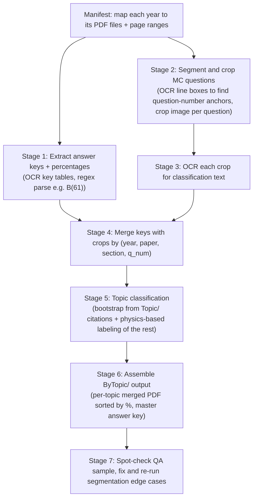

# DSE Physics MC Topic Sorter

## What we're working with

All papers are **scanned image PDFs** (no embedded text layer), so everything must go through OCR. Structure varies by year:

- **2012-2022, 2024**: one merged PDF per year (`Year/2016/2016.pdf` etc.) containing Paper 1 + Paper 2 + Marking Scheme + Candidates' Performance (with %) all in one file.
- **2023, 2025**: split into separate files: `P1.pdf`, `P2.pdf`, `MS.pdf`/`P1 Ans.pdf`/`P2 Ans.pdf` (marking scheme with %), `CP.pdf` (candidates' performance, qualitative only).
- **2026**: `P1A.pdf` (MC only), `P1B.pdf` (structured only), `P2.pdf`. No marking scheme yet since it's a future exam &rarr; **no % data available**.

Confirmed scope (per your answers):
- **MC questions only** &mdash; structured/long-answer questions have no published % correct, so they're excluded entirely.
- Sort each topic's questions **descending by % correct** (easiest first).
- Output goes into a **new `ByTopic/` folder**, existing `Topic/` folder is left untouched.
- **2026 included** with % shown as N/A (backfill later once HKEAA publishes its marking scheme).
- Output per topic = **one merged PDF** (cropped question images, in sorted order) **+ a master answer-key spreadsheet**.

Useful discovery: the existing `Topic/` folder's files cite sources inline, e.g. `<HKDSE 2012 Paper IA - 14>`. I'll parse these citations to bootstrap topic labels for free wherever they overlap, cutting down how many questions need fresh classification.

## Pipeline

## Topics

Reuse the existing 28-topic core taxonomy from `Topic/` (temperature/heat, kinetic theory, Newton's laws, waves, electricity, electromagnetism, radioactivity, etc.) plus 4 elective sections mapped directly from Paper 2's fixed sections:
- Section A &rarr; Astronomy and Space Science
- Section B &rarr; Atomic World
- Section C &rarr; Energy and Use of Energy
- Section D &rarr; Medical Physics (new; not covered in the existing `Topic/` folder)

For Paper 2, topic = section, no classification needed. For Paper 1's ~30 questions/year, classification is needed per question.

## Implementation stages

1. **Manifest** (`scripts/manifest.json`): explicit per-year mapping of source PDF(s) &rarr; {Paper1 MC page range, Paper2 MC page range, key/% source pages}. Built from the file inspection already done.
2. **Key & % extraction** (`scripts/extract_keys.py`): render key-table pages at high DPI, OCR with `tesseract`, regex-parse patterns like `26. D (68)` or `5.C(67%)` into rows of `(year, paper, section, q_num, key_letter, percent)`.
3. **Question segmentation & cropping** (`scripts/segment_crop.py`): render MC section pages at high DPI, use `tesseract --psm` word/line bounding boxes to find question-number anchors (e.g. line starting `12.` or `3.4`) in the left margin of each column, crop from one anchor to the next (with padding) to `crops/<year>_<paper>_<qnum>.png`. This preserves all diagrams/figures exactly since it's a straight image crop, not a text reconstruction.
4. **Per-crop OCR** for classification text only (not for rendering).
5. **Topic classification** (`scripts/classify.py` + manual pass): 
   - Parse `<HKDSE YYYY Paper ... - N>` citations already present in `Topic/*.pdf` to pre-label overlapping questions.
   - For remaining questions (mostly 2021-2026, plus any gaps), classify using the OCR'd question text against topic keywords, with me reviewing ambiguous/low-confidence cases directly against the cropped image.
6. **Assembly** (`scripts/assemble.py`):
   - Per topic: sort matched questions by % correct descending, merge crops into `ByTopic/<topic>/questions.pdf` with a small caption per question (year, paper, original q number).
   - Master answer key: `ByTopic/answer_key.xlsx` with columns Topic, Year, Paper, Section, Q#, Answer, %Correct, one row per MC question, grouped/sorted by topic then %.
7. **QA pass**: visually spot-check a handful of crops per topic (especially ones with figures) to confirm nothing got cut off or misclassified; fix segmentation/classification bugs and re-run affected years.

## Known limitations to flag upfront

- Structured (long-answer) questions are excluded per your choice &mdash; no % data exists for them.
- 2026 has no % yet; those rows will show `N/A` and can be re-run later once HKEAA publishes results.
- Automatic image cropping from scanned pages is approximate; the QA pass (step 7) exists specifically to catch and fix mis-cropped or mis-classified questions rather than assume perfection.
